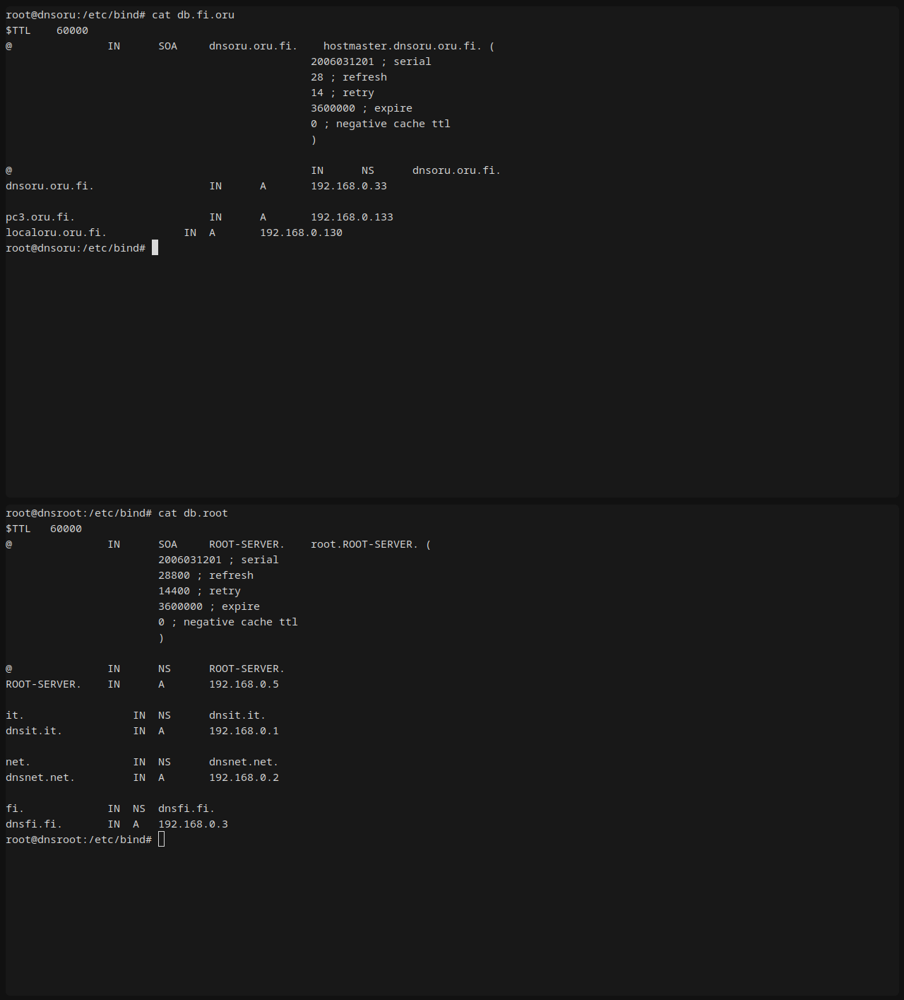
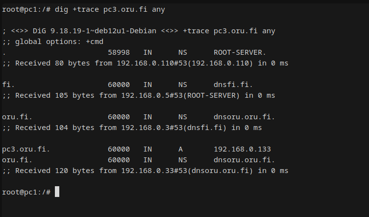
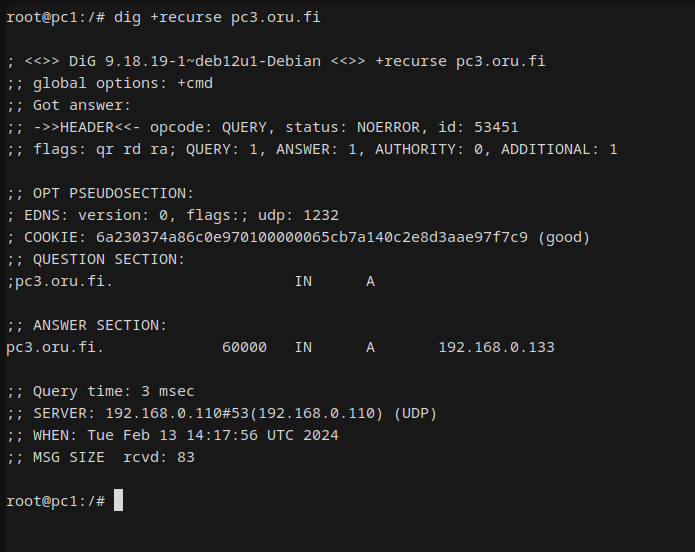

# DNS

The lab is [here](https://github.com/KatharaFramework/Kathara-Labs/tree/main/main-labs/application-level/dns).

### 1.

Screenshot of /etc/bind/db.fi.oru and /etc/bind/db.root  

### 2.

DNS traffic on pc2 caused by pinging pc3.oru.fi from pc1  
[Packet capture file](shared/capture2.pcap)

### 3.

DNS traffic on pc2 caused by pinging pc3.oru.fi from pc1 (cached)  
[Packet capture file](shared/capture3.pcap)

### 4.

DNS traffic caused by pinging non-existing target (non-cached)
[Packet capture file](shared/capture4_noncached.pcap)  

DNS traffic caused by pinging non-existing target (cached)
[Packet capture file](shared/capture4_cached.pcap) 

### 5.

DNS traffic from iterative query  
[Packet capture file](shared/capture5.pcap)

Screenshot  

### 6.

DNS traffic from recursive query  
[Packet capture file](shared/capture6.pcap)

Screenshot  
