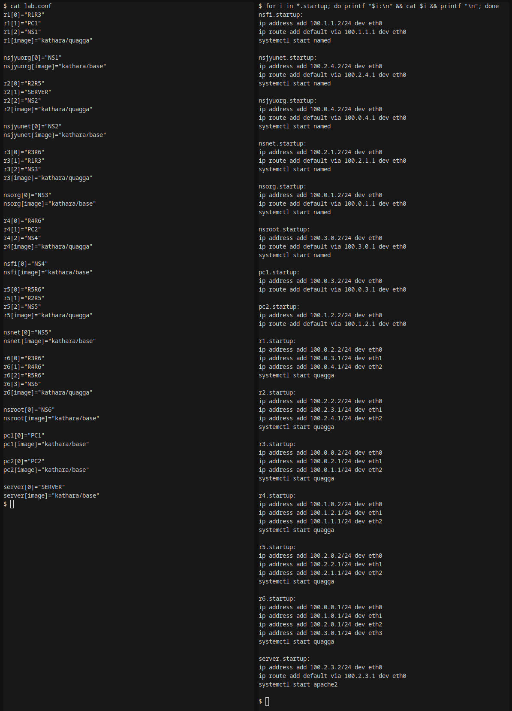
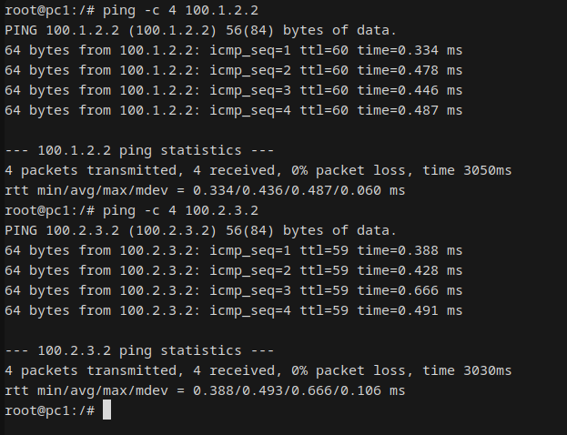
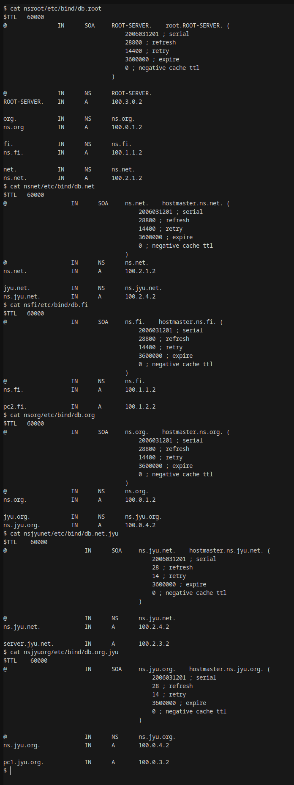
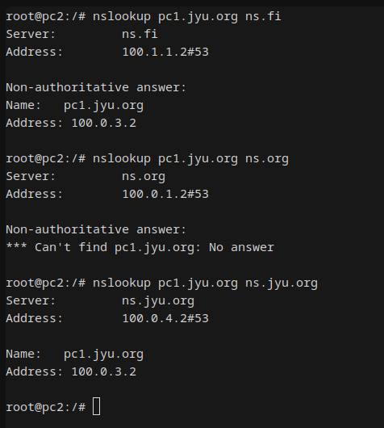
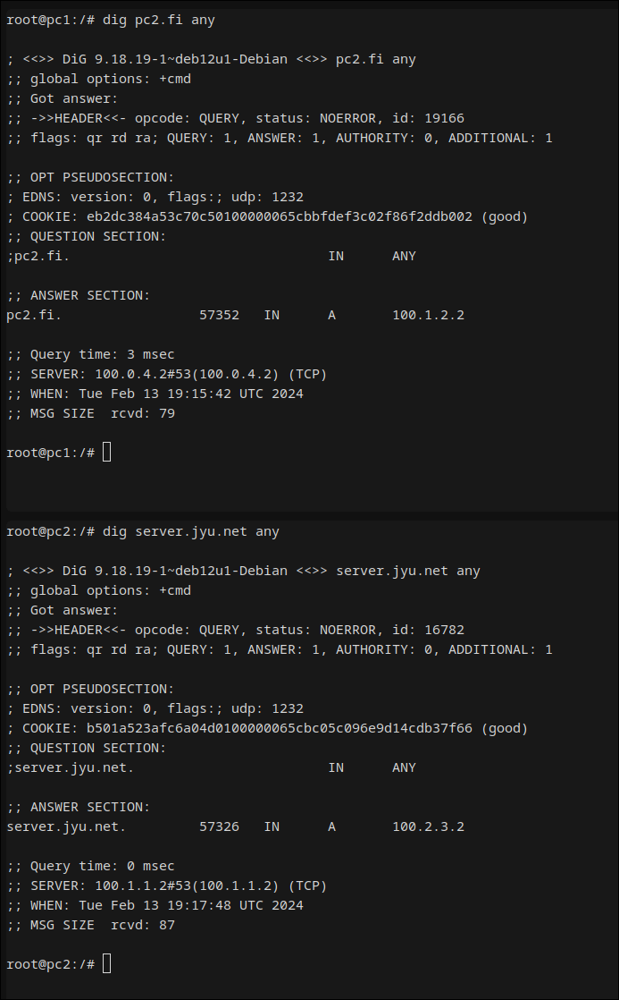

# Walkthrough

The lab is [here](http://users.jyu.fi/~arjuvi/opetus/ties323/2018/demot.html).

### 1. IP addresses and collision domains set

### 2. Routing working

### 3. DNS databases

### 4. Using nslookup

### 5. Capturing DNS traffic  
- [Packet capture file](shared/capture5_nsnet.pcap) ns.net
- [Packet capture file](shared/capture5_nsjyunet.pcap) ns.jyu.net

### 6. Using dig

