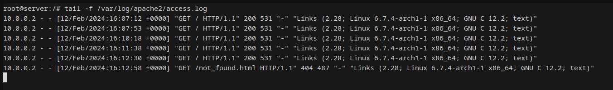

# Web server

The lab is [here](https://github.com/KatharaFramework/Kathara-Labs/tree/main/main-labs/application-level/web-server).

### Packet capture

- [pcap-file](shared/monitor.pcap) from the third node (10.0.0.3)
- [pcap as text](shared/monitor.txt)

### Screen capture



### Server logs

- [access log](shared/access.log), which shows both successful and failed page requests
- [error log](shared/error.log) - server error log, nothing really interesting here

```
root@server:/# tail -f /var/log/apache2/access.log
10.0.0.2 - - [12/Feb/2024:16:07:12 +0000] "GET / HTTP/1.1" 200 531 "-" "Links (2.28; Linux 6.7.4-arch1-1 x86_64; GNU C 12.2; text)"
10.0.0.2 - - [12/Feb/2024:16:07:53 +0000] "GET / HTTP/1.1" 200 531 "-" "Links (2.28; Linux 6.7.4-arch1-1 x86_64; GNU C 12.2; text)"
10.0.0.2 - - [12/Feb/2024:16:10:18 +0000] "GET / HTTP/1.1" 200 531 "-" "Links (2.28; Linux 6.7.4-arch1-1 x86_64; GNU C 12.2; text)"
10.0.0.2 - - [12/Feb/2024:16:11:38 +0000] "GET / HTTP/1.1" 200 531 "-" "Links (2.28; Linux 6.7.4-arch1-1 x86_64; GNU C 12.2; text)"
10.0.0.2 - - [12/Feb/2024:16:12:30 +0000] "GET / HTTP/1.1" 200 531 "-" "Links (2.28; Linux 6.7.4-arch1-1 x86_64; GNU C 12.2; text)"
10.0.0.2 - - [12/Feb/2024:16:12:58 +0000] "GET /not_found.html HTTP/1.1" 404 487 "-" "Links (2.28; Linux 6.7.4-arch1-1 x86_64; GNU C 12.2; text)"
```
