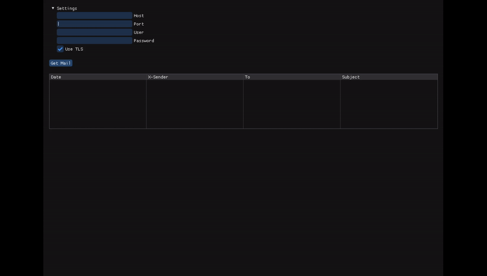

Example of usage:  


Debug log:  
```
S: +OK POP3 mx.zoho.eu v1.0 server ready <7322745.1707994078892@mx.zoho.eu>
C: USER adafiii@zohomail.eu
S: +OK
C: PASS <redacted>
S: +OK
C: LIST
S: +OK 3 messages (1526 octets)
S: 1 775
S: 2 565
S: 3 186
S: .
C: RETR 1
S: +OK
S: Delivered-To: adafiii@zohomail.eu
S: Received-SPF: pass (zohomail.eu: domain of oru.fi designates 217.70.183.193 as permitted sender) client-ip=217.70.183.193; envelope-from=liia@oru.fi; helo=relay1-d.mail.gandi.net;
S: Authentication-Results: mx.zohomail.eu;
S: 	dkim=pass;
S: 	spf=pass (zohomail.eu: domain of oru.fi designates 217.70.183.193 as permitted sender)  smtp.mailfrom=liia@oru.fi
S: ARC-Seal: i=1; a=rsa-sha256; t=1707946928; cv=none;
S: 	d=zohomail.eu; s=zohoarc;
S: 	b=hB9QgJ0PFCbSbRrR6ruRD5Ymp7RHmFOerlOvFl0ignKYKszwuqWWKF5YBKofeOI0zNMdPInXk3OpLEFwbi3eKrggdqpraty3xgOq5m1kWeRTHolV/leTvP9XGOq6vkt340jCaoHN+rXMe+eA89Ag1wqg8J+YGwH794APL2olNoI=
S: ARC-Message-Signature: i=1; a=rsa-sha256; c=relaxed/relaxed; d=zohomail.eu; s=zohoarc;
S: 	t=1707946928; h=Content-Type:Content-Transfer-Encoding:Date:Date:From:From:MIME-Version:Message-ID:Subject:Subject:To:To:Message-Id:Reply-To:Cc;
S: 	bh=J0Xz+B6Qb43+uX62lFBUWcj6rz36NqMzK+crXeHBnfI=;
S: 	b=Cn8u/NSUQlwebHL51a6ZW9kkuqVArYhSGuEC2ZAglTZEHIcfBTVQ0u763wWV2mALe4EpX8vfc0dHdUJZjzB6wW7OYXDfWhymMhm/D5K9Is/ZIY8jbEG4QHUSoUmHkQezXLp7I+a/DALJVgMxATQ4GGxl2JwUHpM67pApcGqozms=
S: ARC-Authentication-Results: i=1; mx.zohomail.eu;
S: 	dkim=pass;
S: 	spf=pass (zohomail.eu: domain of oru.fi designates 217.70.183.193 as permitted sender)  smtp.mailfrom=liia@oru.fi
S: Return-Path: <liia@oru.fi>
S: Received: from relay1-d.mail.gandi.net (relay1-d.mail.gandi.net [217.70.183.193]) by mx.zoho.eu
S: 	with SMTPS id 1707946927980470.9840509833999; Wed, 14 Feb 2024 22:42:07 +0100 (CET)
S: Received: by mail.gandi.net (Postfix) with ESMTPA id 1CE64240005
S: 	for <adafiii@zohomail.eu>; Wed, 14 Feb 2024 21:42:06 +0000 (UTC)
S: DKIM-Signature: v=1; a=rsa-sha256; c=relaxed/relaxed; d=oru.fi; s=gm1;
S: 	t=1707946927;
S: 	h=from:from:reply-to:subject:subject:date:date:message-id:message-id:
S: 	 to:to:cc:mime-version:mime-version:content-type:content-type:
S: 	 content-transfer-encoding:content-transfer-encoding;
S: 	bh=J0Xz+B6Qb43+uX62lFBUWcj6rz36NqMzK+crXeHBnfI=;
S: 	b=gNeopChUyppzulj7SkizH/1SL/yYJXegDPOe1kENh/Ql9mOYmBRJSZl5Ex9u5OyREAxlCz
S: 	6KBcqH1iMzcDUevoaW35E6qY+JHQ4SGTYl8J59K7a3JO4IaNsm4NldsY9fIh0DjAJySO3G
S: 	2sps6+DgaEy8YHpD6J5MCyiZWpz2iDGC6wZ45KGARWmRxpxrGvr6AammJApgZmm89NPO1u
S: 	vu8PTQfWunD68ol4B4n7hZgifJsxt6U9MoZ6c0DczM4RG1zo3kcLgwhAim/3qZ42+pKRm9
S: 	KaYzH05GTpxbkQ0qChZyeVEPpjujwM43MEj0SLUNcKWWQAJroNWqjdqsgk3Sog==
S: MIME-Version: 1.0
S: Date: Wed, 14 Feb 2024 23:42:06 +0200
S: From: =?UTF-8?Q?Liia_Rimpil=C3=A4inen?= <liia@oru.fi>
S: To: adafiii@zohomail.eu
S: Subject: Invitation to Collaborate on Exciting Project
S: Message-ID: <54014e69a6c28aa00743ddbed3fe3ff9@oru.fi>
S: X-Sender: liia@oru.fi
S: Content-Type: text/plain; charset=US-ASCII;
S:  format=flowed
S: Content-Transfer-Encoding: 7bit
S: X-GND-Sasl: liia@oru.fi
S: X-ZohoMail-DKIM: pass (identity @oru.fi)
S: X-ZohoMail-Owner: <54014e69a6c28aa00743ddbed3fe3ff9@oru.fi>+zmo_0_liia@oru.fi
S: X-ZM-MESSAGEID: 1707946930140000001
S:
S: Dear Adafiii,
S:
S: I hope this email finds you well. I am reaching out to discuss an
S: exciting opportunity for collaboration on a project that aligns closely
S: with your expertise and interests.
S:
S: After reviewing your work and achievements in [relevant field or area],
S: I am impressed by your innovative approach and commitment to excellence.
S: I believe that your insights and contributions would greatly enhance our
S: project.
S:
S: I would love to discuss this opportunity further at your earliest
S: convenience. Please let me know a time that works best for you, and I
S: will be happy to arrange a meeting or call.
S:
S: Thank you for considering this collaboration. I look forward to the
S: possibility of working together and achieving great results.
S:
S: Best regards,
S: Liia
S: .
C: RETR 2
S: +OK
S: Delivered-To: adafiii@zohomail.eu
S: Received-SPF: pass (zohomail.eu: domain of oru.fi designates 217.70.183.201 as permitted sender) client-ip=217.70.183.201; envelope-from=liia@oru.fi; helo=relay8-d.mail.gandi.net;
S: Authentication-Results: mx.zohomail.eu;
S: 	dkim=pass;
S: 	spf=pass (zohomail.eu: domain of oru.fi designates 217.70.183.201 as permitted sender)  smtp.mailfrom=liia@oru.fi
S: ARC-Seal: i=1; a=rsa-sha256; t=1707947013; cv=none;
S: 	d=zohomail.eu; s=zohoarc;
S: 	b=V+ZI9gYEmlYxNn2/j1MYfeZfDedeXByE0tndz0/7L+DqAFQVI/W3E2fG7vzQzblMUvRe1WTeH7Wzcr6vvgsHNqVtrRuvReWyTDDbAHmdf9HI6rs1Eb9uAdHe8WrD1KYoLSwnyF+9DIRYM1zD9wS9AwHExeN7cX7zz+V70hxj748=
S: ARC-Message-Signature: i=1; a=rsa-sha256; c=relaxed/relaxed; d=zohomail.eu; s=zohoarc;
S: 	t=1707947013; h=Content-Type:Content-Transfer-Encoding:Date:Date:From:From:MIME-Version:Message-ID:Subject:Subject:To:To:Message-Id:Reply-To:Cc;
S: 	bh=MC5FsjCNKl6Rl4L2CIUp6708BRxSvI6OJdAVXE1oQmo=;
S: 	b=R+1JAs9Qf8ZJ+Sp8UowmEyTQlMx7tYslzyKOU5mrMgR0hRkqjyT3dETPDa8TnhL0oLc/LG/4anojJ0jEgNlScWQLD3HoCf/hOanEV6xwci3Urp/lbj8t8EdKDzXsXFLu/joeC+Cwjgcv0IBEGwbpt6NoQB8lvyTYOoZL/G0QMxU=
S: ARC-Authentication-Results: i=1; mx.zohomail.eu;
S: 	dkim=pass;
S: 	spf=pass (zohomail.eu: domain of oru.fi designates 217.70.183.201 as permitted sender)  smtp.mailfrom=liia@oru.fi
S: Return-Path: <liia@oru.fi>
S: Received: from relay8-d.mail.gandi.net (relay8-d.mail.gandi.net [217.70.183.201]) by mx.zoho.eu
S: 	with SMTPS id 17079470137994.705974742227681; Wed, 14 Feb 2024 22:43:33 +0100 (CET)
S: Received: by mail.gandi.net (Postfix) with ESMTPA id 2268B1BF206
S: 	for <adafiii@zohomail.eu>; Wed, 14 Feb 2024 21:43:32 +0000 (UTC)
S: DKIM-Signature: v=1; a=rsa-sha256; c=relaxed/relaxed; d=oru.fi; s=gm1;
S: 	t=1707947013;
S: 	h=from:from:reply-to:subject:subject:date:date:message-id:message-id:
S: 	 to:to:cc:mime-version:mime-version:content-type:content-type:
S: 	 content-transfer-encoding:content-transfer-encoding;
S: 	bh=MC5FsjCNKl6Rl4L2CIUp6708BRxSvI6OJdAVXE1oQmo=;
S: 	b=kEhDCCMYjeGIJW5cBpe5EGhaKwwfuNeOY8K1NVrheP3YG6HehpRdYKZ6/4NH812ZCyBljz
S: 	moqI1aezN8GKAWcox5yWOfTurLugZVdVHwfGWQqeuZmM0AHz9zfqDYR/sibqmhbihZsaHS
S: 	i/CCfdsZVIL/JfIeAiCwImxW1rmkcPLveM2dUvTYz/hMqM/kVdBzOj9ck4GzUdl1tgwiVj
S: 	9gobXIxSKEM+vOb09aJnA7pXwRdA34SCViqTUb87E1cEJaOz8Z2hJ19Hy7tauogonrBgI5
S: 	SYvG8W1oZ2EbBKAoOUNTIBd41/8bx53jP9lw6C2MckIyGAMxqskaCSXDaw1AEA==
S: MIME-Version: 1.0
S: Date: Wed, 14 Feb 2024 23:43:32 +0200
S: From: =?UTF-8?Q?Liia_Rimpil=C3=A4inen?= <liia@oru.fi>
S: To: adafiii@zohomail.eu
S: Subject: Update on Project Timeline
S: Message-ID: <58612d1c33c39945e535e4e9257e5ad5@oru.fi>
S: X-Sender: liia@oru.fi
S: Content-Type: text/plain; charset=US-ASCII;
S:  format=flowed
S: Content-Transfer-Encoding: 7bit
S: X-GND-Sasl: liia@oru.fi
S: X-ZohoMail-DKIM: pass (identity @oru.fi)
S: X-ZohoMail-Owner: <58612d1c33c39945e535e4e9257e5ad5@oru.fi>+zmo_0_liia@oru.fi
S: X-ZM-MESSAGEID: 1707947014620000001
S:
S: Hi Adafiii,
S:
S: I hope this message finds you well. I wanted to provide a quick update
S: on the timeline for our project. Due to unforeseen circumstances, there
S: has been a slight delay in the schedule.
S:
S: We are working diligently to address these issues and remain committed
S: to delivering high-quality results within a revised timeframe. I
S: appreciate your understanding and flexibility during this time.
S:
S: Please let me know if you have any questions or concerns. Thank you for
S: your continued support and dedication to the project.
S:
S: Best regards,
S: Liia
S: .
C: RETR 3
S: +OK
S: Delivered-To: adafiii@zohomail.eu
S: Received-SPF: pass (zohomail.eu: domain of oru.fi designates 217.70.183.200 as permitted sender) client-ip=217.70.183.200; envelope-from=liia@oru.fi; helo=relay7-d.mail.gandi.net;
S: Authentication-Results: mx.zohomail.eu;
S: 	dkim=pass;
S: 	spf=pass (zohomail.eu: domain of oru.fi designates 217.70.183.200 as permitted sender)  smtp.mailfrom=liia@oru.fi
S: ARC-Seal: i=1; a=rsa-sha256; t=1707947067; cv=none;
S: 	d=zohomail.eu; s=zohoarc;
S: 	b=a7p1dLf53z8DkqJAA9HzctcaQCpg5Ey9yHYT1xYgCk+0nU+NN2saaq7VD+1/gb2/sdDXTNMAke4YTBLUYh81BZY767SnC0JMgIsVuDe+FRnmd5knzTu5Nb9tjxSUD/iHb++FS2hgANCb1Y6GYzwaHN0Wlw+wQGm9UZUWLBbWs64=
S: ARC-Message-Signature: i=1; a=rsa-sha256; c=relaxed/relaxed; d=zohomail.eu; s=zohoarc;
S: 	t=1707947067; h=Content-Type:Content-Transfer-Encoding:Date:Date:From:From:MIME-Version:Message-ID:Subject:Subject:To:To:Message-Id:Reply-To:Cc;
S: 	bh=w9YKKvbjKGPxLf4KPAdielz7dnB9xp5w1NgrjS3jnCw=;
S: 	b=bn1EpByeUXC6tR5+YdIRCb+3AnkGTdDQELuVsJ/1YZgFh0krKkqcQHjkcNigrPHwC2+xfOHXwYKxE96AbqTuIDm6eeRGpfY4fOxRHSAz/lXhW9otigx6/htMamKUGB1R3F9oNG2/oOSv4OlDlbCkPJjgbojibrp+/txsf2rfJDk=
S: ARC-Authentication-Results: i=1; mx.zohomail.eu;
S: 	dkim=pass;
S: 	spf=pass (zohomail.eu: domain of oru.fi designates 217.70.183.200 as permitted sender)  smtp.mailfrom=liia@oru.fi
S: Return-Path: <liia@oru.fi>
S: Received: from relay7-d.mail.gandi.net (relay7-d.mail.gandi.net [217.70.183.200]) by mx.zoho.eu
S: 	with SMTPS id 1707947067909572.2585884156847; Wed, 14 Feb 2024 22:44:27 +0100 (CET)
S: Received: by mail.gandi.net (Postfix) with ESMTPA id 0279020005
S: 	for <adafiii@zohomail.eu>; Wed, 14 Feb 2024 21:44:26 +0000 (UTC)
S: DKIM-Signature: v=1; a=rsa-sha256; c=relaxed/relaxed; d=oru.fi; s=gm1;
S: 	t=1707947067;
S: 	h=from:from:reply-to:subject:subject:date:date:message-id:message-id:
S: 	 to:to:cc:mime-version:mime-version:content-type:content-type:
S: 	 content-transfer-encoding:content-transfer-encoding;
S: 	bh=w9YKKvbjKGPxLf4KPAdielz7dnB9xp5w1NgrjS3jnCw=;
S: 	b=ZcChifGEU6YV5T5owQG7RurcjZk0r7/Y1tu6lHk30CA3tkyYjAguVQ3DkmMNd2l/mZFnJG
S: 	UtAxw++Cxs8CB3cbm/Un9mPMwTFtnkl/24nG+xyi/axwOLM1Be93RtUTegPeCxsyPqQqqs
S: 	mzSsCc1VzCusI3fIeklCmNTTDRmYfDkavEstNf5C8LddYouwXW7aRr9L5MKulYO0zDcM5u
S: 	62KLEYjx7DZDMGwq6RNFHc7bOOSaxWqW0t5EHd7khfWZ6DwHyV3X7LrXjAF2vZxjvbeQSQ
S: 	mU6Poagv984pbCSnz/QMqSAki+FozR7Y+5DRhITkySCORlggsaoGL5/AqCpIFg==
S: MIME-Version: 1.0
S: Date: Wed, 14 Feb 2024 23:44:26 +0200
S: From: =?UTF-8?Q?Liia_Rimpil=C3=A4inen?= <liia@oru.fi>
S: To: Adafiii <adafiii@zohomail.eu>
S: Subject: Quick Favor?
S: Message-ID: <36630936a54ab1047a72c77a01e81434@oru.fi>
S: X-Sender: liia@oru.fi
S: Content-Type: text/plain; charset=US-ASCII;
S:  format=flowed
S: Content-Transfer-Encoding: 7bit
S: X-GND-Sasl: liia@oru.fi
S: X-ZohoMail-DKIM: pass (identity @oru.fi)
S: X-ZohoMail-Owner: <36630936a54ab1047a72c77a01e81434@oru.fi>+zmo_0_liia@oru.fi
S: X-ZM-MESSAGEID: 1707947069014000001
S:
S: Hey,
S:
S: Hope you're doing awesome! Could you do me a quick favor? Just need your
S: input on something. Let me know when you've got a minute to chat.
S:
S: Thanks a bunch!
S:
S: Cheers,
S: Liia
S: .
C: QUIT
S: +OK mx.zoho.eu Service closing transmission channel
```