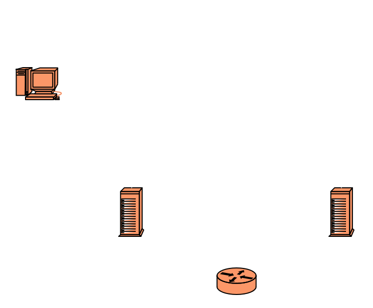

# Log of setting up web, email, and DNS servers

The goal of this project is to set up web, email, and DNS services on real servers. To make the project more interesting, I plan to open at least the web and DNS services to the public internet. Although I am not an IT security expert, I will do my best to protect the servers from unauthorized access. There isn't any valuable information on the servers, but in the worst case, the servers and the services on them could be used to launch further attacks and spamming. 

## Initial setup

- My own Linux desktop, which I use to set up everything remotely
- Two low-spec VPS servers with public IP4 and IP6 addresses
    - ns-ofu, dns server 
    - mail-ofu, mail and web server
- Domain name ofu.fi

## Operating system installation

### Installed OpenBSD 7.4 to mail-ofu (30 minutes)

- I started by installing OpenBSD to mail-ofu. My VPS provider offers an option to boot KVM console into wide selection of installation images, which made this part easy.
- OpenBSD installer is pretty straightforward and I have used it before so the installation was quick.
- Only issue I run into was that first I used GPT partitioning and realized after failed reboot that the hypervisor only supported MBR, so I had to reinstall with correct MBR partitioning.
- Finally, I made some minimal post install configurations:
    - Updated the system and packages (syspatch & pkg_add -Uu)
    - Installed my favourite text editor
    - Configured doas (similar to sudo) so that normal user can run commands as root
    - Configured public key SSH login for normal user, and disabled root and password login
    - Moved SSH to non-standard port 2288 to hopefully decrease random login attempts

### Installed AlmaLinux 9.3 to ns-ofu (50 minutes)

- I wanted to try this RHEL clone. Unfortunately, I couldn't install this manually through KVM console because both GUI and CLI installers didn't work with the console
- There is option to use installer through VNC, but VNC client refused to connect to the installer
- VPS provider had an option to use pre-installed disk image, which I installed to ns-ofu
- Post installation steps:
    - Updated the system (dnf update)
    - Created normal user and made sure it can run sudo commands as root
    - Configured public key SSH login for normal user, and disabled root and password login
    - Moved SSH to port 2288

## Network

### Network configuration (30 minutes)

- It seems that both servers got correct network configuration from dhcp.
- Conceptually, the network configuration looks like this

- VPS provider offered an option to connect servers to a private network, 10.0.0.0/24. This was quick to set up and might come useful later.
- I noticed that the servers are isolated in the private network and can only communicate through the router 10.0.0.1

### Setting firewall for ns-ofu (40 minutes)

- I decided to use nftables to configure firewall. 
- Getting the firewall rules right took some studying, because I haven't used nftables much. Luckily, there was a simple example configuration and [RHEL manuals](https://access.redhat.com/documentation/en-us/red_hat_enterprise_linux/9/html/configuring_firewalls_and_packet_filters/getting-started-with-nftables_firewall-packet-filters).
- I edited the ruleset to allow: 
    - Incoming TCP connections to SSH port 2288
    - Returning traffic
    - ICMP
- Outgoing traffic seems to be allowed by default
- After enabling and starting nftables service:
```
$ sudo nft list ruleset
table inet nftables_svc {
	set allowed_protocols {
		type inet_proto
		elements = { icmp, ipv6-icmp }
	}

	set allowed_interfaces {
		type ifname
		elements = { "lo" }
	}

	set blocked_interfaces {
		type ifname
		elements = { "eth1" }
	}

	set allowed_tcp_dports {
		type inet_service
		elements = { 2288 }
	}

	chain allow {
		ct state established,related accept
		meta l4proto @allowed_protocols accept
		iifname @allowed_interfaces accept
		iifname @blocked_interfaces drop
		tcp dport @allowed_tcp_dports accept
	}

	chain INPUT {
		type filter hook input priority 20; policy accept;
		jump allow
		drop
	}

	chain FORWARD {
		type filter hook forward priority 20; policy accept;
		jump allow
		drop
	}
}
```

### Setting firewall for mail-ofu (50 minutes)

- OpenBSD uses PF as firewall. It's enabled by default, but the ruleset should be still customized to be strict as possible.
- [PF user's guide](https://www.openbsd.org/faq/pf/index.html) was a good resource for setting up the firewall 
- I configured PF to allow 
    - Outgoing TCP, UDP and ICMP connections (I might restrict this more later if needed)
    - Incoming TCP connections to SSH port 2288 
- PF tracks the state by default, so returning traffic, both ways, always passes unless explicitly denied
- After setting the rules:
```
mail$ doas pfctl -sr
match in all scrub (no-df)
block drop all
pass out on egress proto tcp all flags S/SA modulate state
pass out on egress proto udp all
pass out on egress proto icmp all
pass in on egress proto tcp from any to any port = 2288 flags S/SA
```

## Configuring DNS 

- Again, I used [RHEL manuals](https://access.redhat.com/documentation/en-us/red_hat_enterprise_linux/9/html/managing_networking_infrastructure_services/assembly_setting-up-and-configuring-a-bind-dns-server_networking-infrastructure-services) as my primary source.
- To find more detailed information, I used [BIND manual](https://bind9.readthedocs.io/en/latest/index.html).
- I installed bind to ns-ofu (dnf install bind).
- Set SELinux to enforcing mode to harden bind against known vulnerabilities.
- Edited /etc/hosts to 
```
65.108.60.126           ns.ofu.fi ns-ofu
127.0.0.1               localhost

2a01:4f9:c012:7e00::1   ns.ofu.fi ns-ofu
::1                     localhost
```
- By default, bind is configured to act as a local DNS resolver server. I want it to act as a public authoritative server.
- I changed /etc/named.conf to disable recursion and accept connections from the public internet.
- /etc/named.conf also needs to have forward zone definition:
```
zone "ofu.fi" {
        type master;
        file "ofu.fi.zone";
        allow-query { any; };
        allow-transfer { none; };
};
```
- Config file was validated with named-checkconf command.
- File /var/named/ofu.fi.zone was added:
```
$TTL 8h
@ 		IN 		SOA		ns.ofu.fi.	admin.oru.fi. (
								    2024030401 ; serial number
								    1d         ; refresh period
								    3h         ; retry period
							        3d         ; expire time
								    3h )       ; minimum TTL
		IN		NS		ns.ofu.fi.
ns		IN		A		65.108.60.126
ns		IN		AAAA	2a01:4f9:c012:7e00::1

mail	IN		A		95.217.16.28
mail	IN		AAAA	2a01:4f9:c012:c33e::1

www		IN		CNAME	mail.ofu.fi.
```
- Mail address is not a typo, it's my other domain.
- Changed file permissions according to RHEL manual and validated zone-file:
```
# chown root:named /var/named/ofu.fi.zone
# chmod 640 /var/named/ofu.fi.zone
# named-checkzone ofu.fi /var/named/ofu.fi.zone
zone ofu.fi/IN: loaded serial 2024030401
OK
```
- I opened port 53 for udp and tcp traffic from nftables config and reloaded nftables
- Finally, 'systemctl enable --now named' to enable and start bind
- Because my nameserver is within my domain, I need to set up glue record to my domain registrar.
